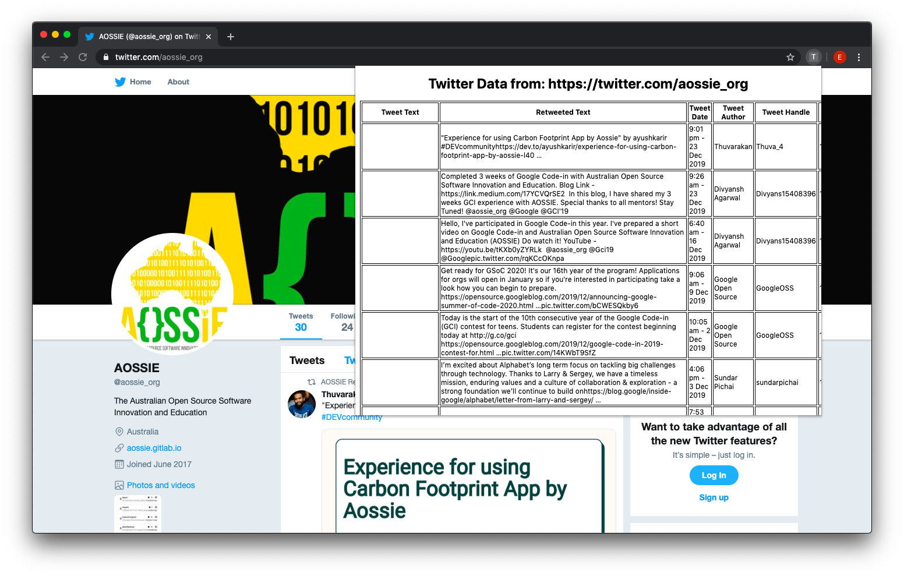
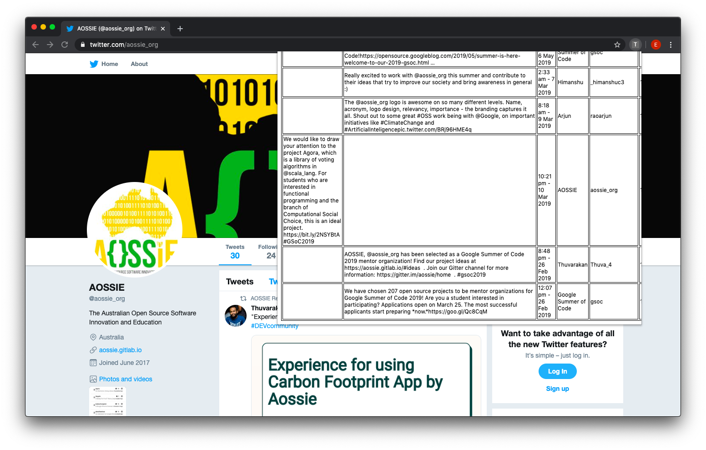

# TwitterScrapper

## Description
TwitterScrapper is a Chrome extension that looks targets Twitter pages.

It looks for the following fields in the DOM for a Tweet post:
* handle
* author
* date & time
* id
* content

And pulls these relevant data into a HTML table.

